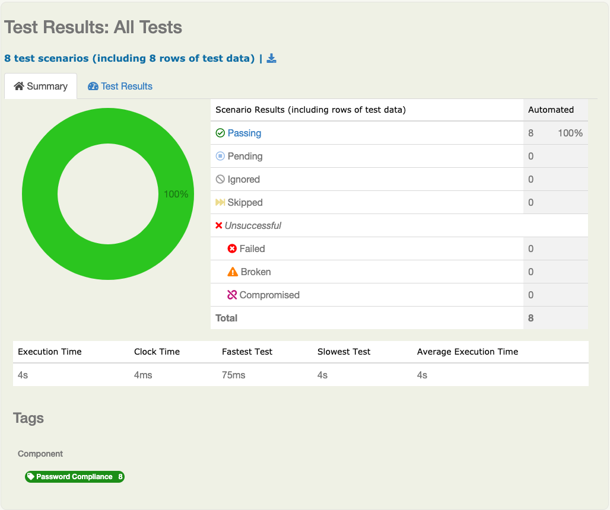

# Acceptance Tests
To run the _Acceptance Tests_, execute the following in command line on the project's root directory:
```bash
mvn verify
```
>Note: use _mvn clean verify_ for subsequent builds
## Acceptance Test Reports
After the build has run, the Acceptance Test reports can be found in _target/site/serenity_. Use a browser to view the _index.html_ file.

### Test Results Page
